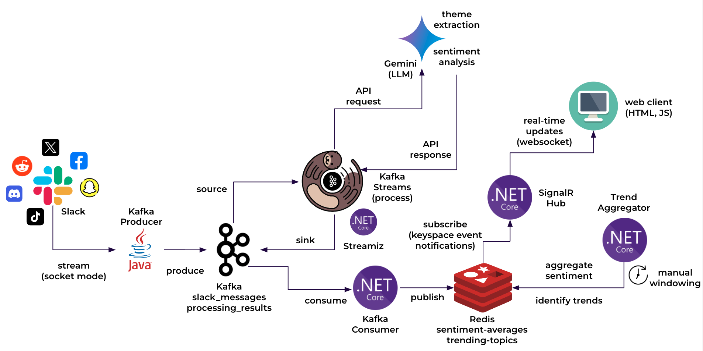
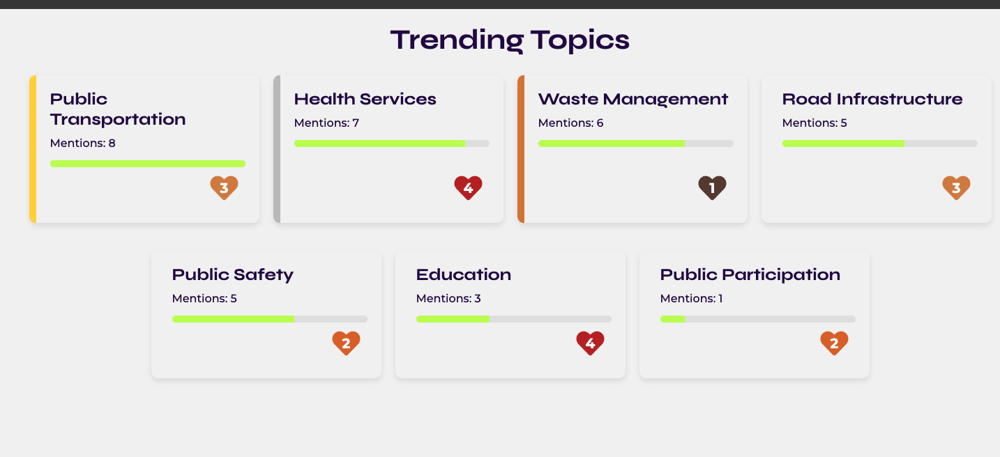

# Local Government Pulse

Local Government Pulse is a real-time Kafka stream processing system built using .NET 8. This project demonstrates how to process streaming data for local government issues, analyse sentiment, and identify trending topics using Gemini and Redis.

### Key Technologies:

*   **.NET 8:** The latest version of the .NET platform for building high-performance applications.
*   **Kafka:** A distributed event streaming platform for handling high-throughput data streams.
*   **Streamiz.Kafka.Net:** A library enabling Kafka Streams on .NET, allowing stream processing applications to be built and run within the .NET ecosystem.
*   **Docker:** Containerisation of the services required for seamless deployment.
*   **Gemini:** A powerful large language model used for sentiment analysis and theme identification.
*   **dotnet-gemini-sdk:** A .NET SDK for interacting with the Gemini API. (https://github.com/gsilvamartin/dotnet-gemini-sdk)
*   **Redis:** An in-memory data store used to track sentiment trends and identify trending topics.
*   **StackExchange.Redis:** A .NET client library for interacting with Redis
*   **SignalR:** A .NET library for adding real-time web functionality to applications.

### System Components:



*   **Kafka Topics:**
    *   `slack_messages`: Ingests raw messages from Slack (or other sources)
    *   `processing_results`: Stores the results of sentiment analysis and theme identification performed by Gemini.

*   **Stream Processing (`stream-processor`):**
    *   Consumes messages from the `slack_messages` topic.
    *   Processes messages using the `IMessageProcessingService` (which interacts with Gemini).
    *   Produces the analysis results (JSON objects) to the `processing_results` topic.

*   **Redis Consumer (`redis-consumer`):**
    *   Consumes messages from the `processing_results` topic.
    *   Updates Redis data structures to track sentiment trends and mention counts.

*   **Trend Aggregator (`redis-consumer`):**
    *   Emulates windowing and aggregation in a stream processing application.  
    *   Runs periodically as a background service.
    *   Calculates relevance by aggregating sentiment data and mention counts from Redis.
    *   Updates the `trending-topics` sorted set to reflect the current trending topics.
  
*   **Web API (`front-end`):**
    *   Hosts the SignalR hub (`TrendHub`) for real-time communication with the front-end.
    *   Serves the static files for the front-end application (HTML, CSS, JavaScript).

### Resource Allocation:

[Resource Allocation Guide](RESOURCE_ALLOCATION.md) - A detailed explanation of the resource allocation for each component, based on a MacBook Pro environment.

### Data Processing Flow:

1.  **Ingest:** Raw messages are received from the `slack_messages` topic.
2.  **Process:** Messages are sent to Gemini for sentiment analysis and theme identification.
3.  **Store:** The analysis results (JSON objects) are sent to the `processing_results` topic.
4.  **Consume and Update Redis:** The `redis-consumer` consumes the analysis results and updates Redis data structures.
5.  **Aggregate and Identify Trends:** The `TrendAggregator` works like a manual windowing function. It periodically aggregates the data in Redis and updates the `trending-topics` sorted set.
6.  **Real-time Updates via SignalR:** The `TrendHub` in the Web API retrieves data from Redis and pushes updates to connected clients in real-time using SignalR.

### Redis Data Structures:

*   **Sorted Set: `trending-topics`**
    *   Stores the themes, sorted by relevance in descending order.
    *   The scores in this sorted set represent the relevance of each theme (currently implemented as total mention count).

*   **Hash: `sentiment-averages`**
    *   Stores the cumulative sentiment scores and mention counts for each theme.
    *   The keys in this hash are the theme names.
    *   The values are JSON strings containing two properties:
        *   `totalSentiment`: The running sum of all sentiment scores for the theme.
        *   `mentionCount`: The total number of times the theme has been mentioned.

### Front-End Visualization:



The front-end application provides a visually engaging display of the trending topics, as shown in the illustration above. 
It uses a card-based layout, where each card represents a trending topic. The cards are ranked based on relevance 
(mention count), with the top 3 topics highlighted in gold, silver, and bronze colours. The sentiment score for each topic 
is represented by a heart-shaped indicator at the bottom right of the card, with the colour of the heart reflecting the 
sentiment level (ranging from dark red for very positive to dark brown for very negative). The cards update in real-time 
as new data arrives from the SignalR hub, without requiring a manual refresh of the page.

---

### Setting Up and Running the Project

#### Prerequisites:
- Docker and Docker Compose installed on your machine.

#### Clone the Repository:
```bash
git clone https://github.com/tvergilio/local-government-pulse
cd local-government-pulse
```

#### Build and Run the Docker Containers:
```bash
docker-compose up --build
```

#### Creating Kafka Topics:
```bash
docker-compose exec kafka kafka-topics --create --topic slack_messages --partitions 1 --replication-factor 1 --bootstrap-server kafka:9092
docker-compose exec kafka kafka-topics --create --topic results --partitions 1 --replication-factor 1 --bootstrap-server kafka:9092
```

---

### Running Tests
The project uses unit tests for stream processing logic. To run the tests:
```bash
dotnet test
```

---

### Authors:
Thalita Vergilio

### License:
This project is licensed under the MIT License.