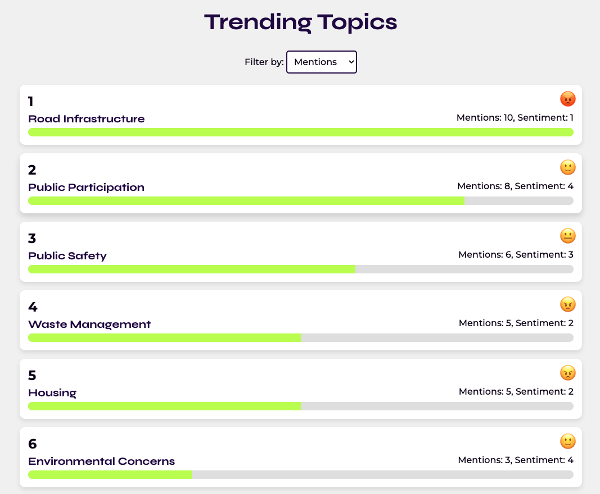

# Local Government Pulse

Local Government Pulse is a real-time Kafka stream processing system built using .NET 8. This project demonstrates how to process streaming data for local government issues, analyse sentiment, and identify trending topics using Gemini and Redis.

### Key Technologies:

*   **.NET 8:** The latest version of the .NET platform for building high-performance applications.
*   **Kafka:** A distributed event streaming platform for handling high-throughput data streams.
*   **Streamiz.Kafka.Net:** A library enabling Kafka Streams on .NET, allowing stream processing applications to be built and run within the .NET ecosystem.
*   **Docker:** Containerisation of the services required for seamless deployment.
*   **Gemini:** A powerful large language model used for sentiment analysis and theme identification.
*   **dotnet-gemini-sdk:** A .NET SDK for interacting with the Gemini API. (https://github.com/gsilvamartin/dotnet-gemini-sdk)
*   **Redis:** An in-memory data store used to track sentiment trends and identify trending topics.
*   **StackExchange.Redis:** A .NET client library for interacting with Redis
*   **SignalR:** A .NET library for adding real-time web functionality to applications.
*   **InfluxDB:** A time-series database for high-performance handling of time-stamped data, used here to store and analyse trend data.
*   **Telegraf:** A plugin-driven agent that collects and sends metrics and events to various outputs, including InfluxDB. Here, it consumes data from Kafka and writes it to InfluxDB.

### System Components:


*   **Kafka Topics:**
    *   `slack_messages`: Ingests raw messages from Slack (or other sources)
    *   `processing_results`: Stores the results of sentiment analysis and theme identification performed by Gemini.

*   **Stream Processing (`stream-processor`):**
    *   Consumes messages from the `slack_messages` Kafka topic.
    *   Processes messages using the `IMessageProcessingService` (which interacts with Gemini).
    *   Produces the analysis results (JSON objects) to the `processing_results` Kafka topic.

*   **Redis Consumer (`redis-consumer`):**
    *   Consumes messages from the `processing_results` Kafka topic.
    *   Updates Redis data structures to track sentiment trends, mention counts and timestamp using a preloaded and cached Lua script for efficiency and atomicity.
    *   Each message updates the sentiment and mention count for the relevant theme and records the current timestamp in the sentiment-averages hash.

*   **Trend Aggregator (redis-consumer):**
    *   Emulates session windowing behaviour using a scheduled background job and atomic Redis transformations through a Lua script. 
    *   Every 45 seconds, the aggregator checks the timestamp of each theme in the sentiment-averages hash to identify relevant and active topics.
    *   Topics remain relevant as long as new data arrives, even if some of the previous messages are older than the window duration. 
    *   This ensures ongoing conversations continue to be tracked accurately, similar to session windows in stream processing frameworks like Apache Flink. 
    *   Data with no new updates within the session window is ignored for trending calculations and is removed from the sentiment-averages hash to prevent outdated entries from affecting results. 
    *   Calculates a topic's relevance by aggregating sentiment data and mention counts from Redis.
    *   Updates the trending-topics sorted set to reflect the current active topics within the session window, ensuring an accurate reflection of real-time activity.
*   **Web API (`front-end`):**
    *   Hosts the SignalR hub (`TrendHub`) for real-time communication with the front-end.
    *   Serves the static files for the front-end application (HTML, CSS, JavaScript).
*   **InfluxDB and Telegraf:**
    *   Telegraf acts as a bridge between Kafka and InfluxDB, consuming data from the full_results Kafka topic and sending it to InfluxDB for time-series storage and analysis.
    *   InfluxDB stores this data, allowing for efficient querying and analysis of trends over time using the UI or API.

### Resource Allocation:

[Resource Allocation Guide](RESOURCE_ALLOCATION.md) - A detailed explanation of the resource allocation for each component, based on a MacBook Pro environment.

### Data Processing Flow:

1.  **Ingest:** Raw messages are received from the `slack_messages` topic.
2.  **Process:** Messages are sent to Gemini for sentiment analysis and theme identification.
3.  **Store:** The analysis results (JSON objects) are sent to the `processing_results` topic.
4.  **Consume and Update Redis:** The `redis-consumer` consumes the analysis results and updates Redis data structures.
5.  **Aggregate and Identify Trends:** The `TrendAggregator` works like a manual windowing function. It periodically aggregates the data in Redis and updates the `trending-topics` sorted set.
6.  **Real-time Updates via SignalR:** The `TrendHub` in the Web API retrieves data from Redis and pushes updates to connected clients in real-time using SignalR.
7.  **Store and Query in InfluxDB:** The full_results topic data is ingested by Telegraf and stored in InfluxDB. This data can be queried and visualised to monitor trends over time, enabling a detailed analysis of local government issues and sentiment.


### Redis Data Structures:

*   **Sorted Set: `trending-topics`**
    *   Stores the themes, sorted by relevance in descending order.
    *   The scores in this sorted set represent the relevance of each theme (currently implemented as total mention count).
    *   The sorted set is refreshed periodically by the `TrendAggregator` to reflect the current trending topics.

*   **Hash: `sentiment-averages`**
    *   Stores the cumulative sentiment scores, mention counts and timestamp for each theme.
    *   The keys in this hash are the theme names.
    *   The values contain three properties:
        *   `totalSentiment`: The running sum of all sentiment scores for the theme.
        *   `mentionCount`: The total number of times the theme has been mentioned.
        *   `timestamp`: The timestamp of the most recent update for the theme.
    * Rationale: This approach simulates a session window, commonly used in stream processing frameworks such as Apache Flink. 
    In Flink, session windows group events that arrive close together in time, keeping the window open while activity continues 
    and closing it after a period of inactivity. <br/><br/>
    Similarly, as long as new messages for a topic arrive within a reasonable period, the topic remains relevant, and all prior 
    messages contribute to its sentiment score. This allows sustained discussions to be accurately tracked without prematurely 
    expiring active topics. <br/><br/>
    When activity dies down, the topic can gracefully "expire". This model avoids the pitfalls of rigid time-based windows, which 
    might fragment long-running discussions and dilute the analysis of critical issues.

### Front-End Visualization:



The front-end application provides a visually engaging display of the trending topics, as shown in the illustration above. <br/><br/>
It uses a ranked list layout, where each row represents a trending topic. <br/>
The topics are ranked based on relevance (mention count), with the ranking number displayed prominently on the left. <br/><br/>
Each row contains the topic title, mention count, and sentiment score, along with a progress bar visualising the relative mention count. <br/><br/>
The sentiment score is represented using an emoji indicator to convey the sentiment level in an intuitive and friendly manner. <br/><br/>
The list is updated in real-time as new data arrives from the SignalR hub, ensuring a dynamic and interactive experience without requiring a manual page refresh.
---

### Setting Up and Running the Project

#### Prerequisites:
- Docker and Docker Compose installed on your machine.

#### Clone the Repository:
```bash
git clone https://github.com/tvergilio/local-government-pulse
cd local-government-pulse
```

#### Build and Run the Docker Containers:
```bash
docker-compose up --build
```

#### Creating Kafka Topics:
```bash
docker-compose exec kafka kafka-topics --create --topic slack_messages --partitions 1 --replication-factor 1 --bootstrap-server kafka:9092
docker-compose exec kafka kafka-topics --create --topic results --partitions 1 --replication-factor 1 --bootstrap-server kafka:9092
```

---

### Running Tests
The project uses unit tests for stream processing logic. To run the tests:
```bash
dotnet test
```

---

### Authors:
Thalita Vergilio

### License:
This project is licensed under the MIT License.